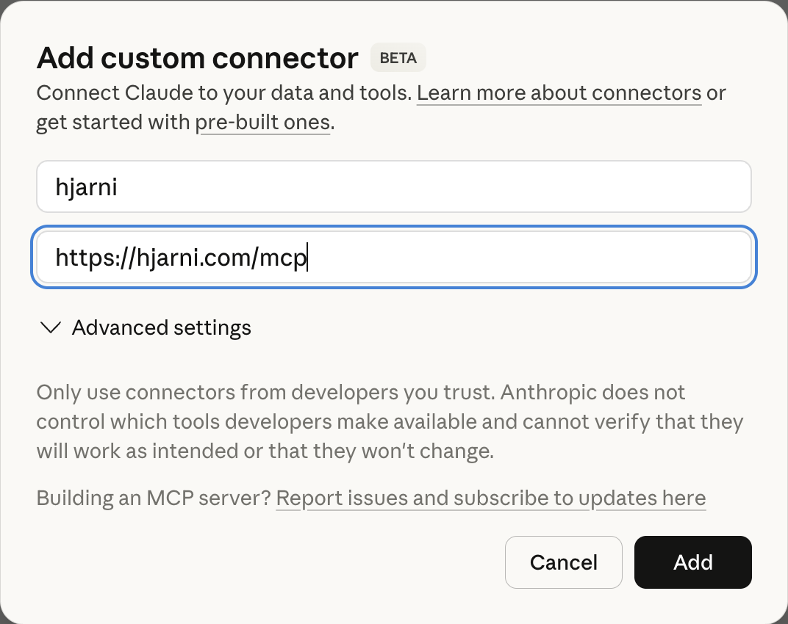

<p align="center">
  
</p>

<h1 align="center">Hjarni</h1>

<p align="center">
  <strong>Give your AI long-term memory.</strong><br>
  Note-taking app with a built-in MCP server.
</p>

<p align="center">
  <a href="https://hjarni.com">Website</a> &middot;
  <a href="https://hjarni.com/docs">Docs</a> &middot;
  <a href="https://hjarni.com/blog">Blog</a>
</p>

---

## What it does

Hjarni is an AI-native note-taking app. Write notes in Markdown, organize them in folders with custom AI instructions per folder, and let Claude or ChatGPT search, read, create, and organize your notes via MCP.

Your notes serve two readers: you and your AI. Hjarni stores the knowledge. ChatGPT and Claude are the interfaces.

<p align="center">
  
</p>

## Connect

Hjarni is a hosted remote MCP server with OAuth authentication. No API keys, no Docker, no local setup. Setup takes under 2 minutes.

### Claude.ai / Claude iOS

1. Open **Settings > Integrations**
2. Tap **Add custom connector**
3. Set the name to `hjarni` and the URL to `https://hjarni.com/mcp`
4. Tap **Add** and log in to Hjarni when redirected



> Requires Claude Pro or Team plan for MCP integrations.

### Claude Desktop / Claude Code

Add to your MCP config (`claude_desktop_config.json` or `.claude.json`):

```json
{
  "mcpServers": {
    "hjarni": {
      "url": "https://hjarni.com/mcp",
      "type": "streamable-http"
    }
  }
}
```

Works on any Claude plan. Authenticates via OAuth on first connection.

### ChatGPT

Available in the ChatGPT MCP app directory (pending approval).

### Other MCP clients

Any client that supports streamable HTTP transport can connect. The endpoint is `https://hjarni.com/mcp`. Authentication uses OAuth 2.0 with PKCE. Discovery metadata is at `/.well-known/oauth-authorization-server`.

## Available tools

| Tool | Description |
|------|-------------|
| `search` | Full-text search across notes, containers, and tags |
| `notes-create` | Create a new note with title, body, tags, and container placement |
| `notes-get` | Read a single note including full content, tags, and linked notes |
| `notes-list` | List notes with filtering by container, tags, and sorting |
| `notes-update` | Update content, move notes, change tags, archive/unarchive |
| `notes-delete` | Permanently delete a note |
| `containers-list` | List folders for organizing notes |
| `containers-create` | Create new folders |
| `containers-get` | Get a single container with its AI instructions |
| `containers-update` | Update a container (rename, move, change description) |
| `tags-list` | List all tags |
| `tags-create` | Create new tags |
| `links-manage` | Create or remove bidirectional links between notes |
| `instructions-get` | Read AI instructions set on a folder |
| `instructions-update` | Update folder-level AI instructions |
| `files-attach` | Attach a file to a note |
| `files-attach_from_url` | Fetch a file from a URL and attach it to a note |
| `files-get_download_url` | Get a temporary download URL for a file |
| `files-remove` | Remove a file attachment |
| `dashboard-get` | Overview of the account: note count, containers, tags, inbox |
| `teams-list` | List all teams the user is a member of |
| `teams-get` | Get team details including recent notes |

### Built-in prompts

The server also exposes MCP prompts for clients that support prompt discovery:

| Prompt | Description |
|--------|-------------|
| `summarize_note` | Summarize a note and suggest tags and related links |
| `weekly_review` | Review recent activity and suggest organization improvements |
| `research_topic` | Synthesize everything in the knowledge base related to a topic |

## Usage examples

### Research assistant

> "What decisions have I made about the tech stack?"

Claude searches your notes, follows wiki-links between related notes, and synthesizes a summary from multiple sources.

### Quick capture

> "Save this as a note in my Projects folder and tag it"

Claude finds the right container, creates the note with Markdown formatting, adds tags, and links it to related notes.

### Weekly review

> "Help me triage my inbox"

Claude lists unfiled notes, suggests where each belongs based on your folder structure, and moves them with your approval.

### Writing with context

> "Draft a project update using my recent meeting notes"

Claude pulls relevant notes and uses them as source material.

## Features

- **Markdown notes** with full formatting support
- **Wiki-links** (`[[id:Note Title]]`) for cross-referencing
- **Folders** with custom AI instructions per folder
- **Full-text search** across all content
- **Bidirectional linking** between notes
- **Tags** for cross-cutting categorization
- **File attachments** (Pro plan and above)
- **Team collaboration** with shared knowledge bases
- **REST API** for custom integrations
- **Export** your data as Markdown at any time

## MCP server details

| | |
|---|---|
| **Endpoint** | `https://hjarni.com/mcp` |
| **Transport** | Streamable HTTP with JSON-RPC 2.0 |
| **Protocol versions** | `2025-03-26` and `2024-11-05` |
| **Authentication** | OAuth 2.0 (PKCE) or Bearer token |
| **Capabilities** | Tools and prompts |

For the full protocol reference, see the [MCP server docs](https://hjarni.com/docs/mcp).

## Pricing

| Plan | Price | What you get |
|------|-------|--------------|
| **Free** | $0 | 25 notes, containers, tags, search, full MCP & API access |
| **Pro** | $10/mo | Unlimited notes, file attachments, share with 2 collaborators |
| **Teams** | $13/seat/mo | Shared knowledge base, team MCP & API, member management |

Also available in EUR and GBP. [See pricing](https://hjarni.com/#pricing).

## Links

- [Website](https://hjarni.com)
- [Docs](https://hjarni.com/docs)
- [Getting started](https://hjarni.com/docs/getting-started)
- [MCP server reference](https://hjarni.com/docs/mcp)
- [REST API reference](https://hjarni.com/docs/api)
- [Claude setup guide](https://hjarni.com/docs/claude)
- [ChatGPT setup guide](https://hjarni.com/docs/chatgpt)
- [Blog](https://hjarni.com/blog)
- [Privacy](https://hjarni.com/privacy)
- [Terms](https://hjarni.com/terms)

## Support

Email [evert@hjarni.com](mailto:evert@hjarni.com).
