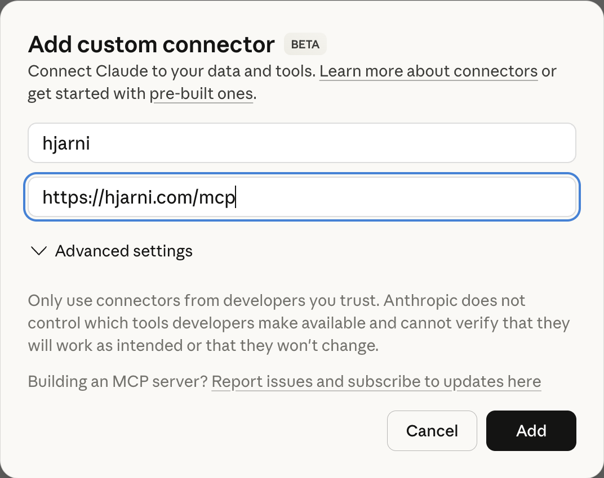
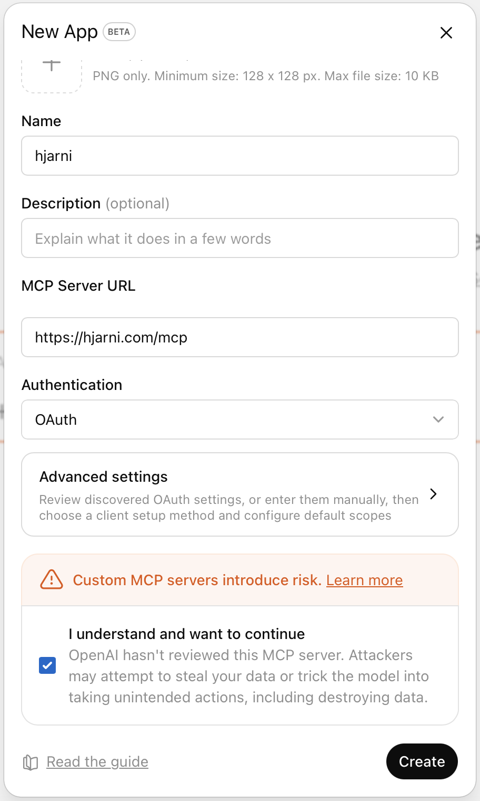

<p align="center">
  
</p>

<h1 align="center">Hjarni</h1>

<p align="center">
  <strong>Give your AI long-term memory.</strong><br>
  Note-taking app with a built-in MCP server.
</p>

<p align="center">
  <a href="https://hjarni.com">Website</a> &middot;
  <a href="https://hjarni.com/docs">Docs</a> &middot;
  <a href="https://hjarni.com/blog">Blog</a>
</p>

---

## What it does

Hjarni is an AI-native note-taking app. Write notes in Markdown, organize them in folders with custom AI instructions per folder, and let Claude or ChatGPT search, read, create, and organize your notes via MCP.

Your notes serve two readers: you and your AI. Hjarni stores the knowledge. ChatGPT and Claude are the interfaces.

<p align="center">
  
</p>

## Connect

Hjarni is a hosted remote MCP server with OAuth authentication. No API keys, no Docker, no local setup. Setup takes under 2 minutes.

### Claude.ai / Claude Desktop / Claude mobile

Hjarni is in the Claude Connectors Directory: [open the listing](https://claude.ai/directory/connectors/hjarni-notes), click **Connect**, and sign in.

Or add it by URL:

1. Open **Customize > Connectors**
2. Click **+** then **Add custom connector**
3. Enter the URL `https://hjarni.com/mcp`
4. Click **Add** and log in to Hjarni when redirected



> Connectors are available on all Claude plans (Free is limited to one). On Team and Enterprise, a workspace owner adds the connector first.

### Claude Code

```sh
claude mcp add --transport http hjarni https://hjarni.com/mcp
```

Add `--scope user` to make it available in every project. Then run `/mcp` inside Claude Code to complete the OAuth sign-in.

### ChatGPT

Hjarni is in the ChatGPT Apps Directory: [open the app page](https://chatgpt.com/plugins/plugin_asdk_app_69c3058914bc81919b807c176a7c106c), click **Connect**, and sign in.

Or add it by URL via developer mode:

1. Go to **Settings > Apps > Advanced settings** and enable **Developer mode**
2. Click **Create app**
3. Set the MCP Server URL to `https://hjarni.com/mcp` and authentication to **OAuth**
4. Click **Create** and log in to Hjarni when redirected



> Requires a paid ChatGPT plan (Plus, Pro, Business, Enterprise, or Education).

### Other MCP clients

Any client that supports streamable HTTP transport can connect. The endpoint is `https://hjarni.com/mcp`. Authentication uses OAuth 2.0 with PKCE. Discovery metadata is at `/.well-known/oauth-authorization-server`.

Setup guides: [Cursor](https://hjarni.com/docs/connect-cursor-mcp) &middot; [Copilot](https://hjarni.com/docs/connect-copilot-mcp) &middot; [Copilot Studio](https://hjarni.com/docs/connect-copilot-studio-mcp) &middot; [Perplexity](https://hjarni.com/docs/connect-perplexity-mcp) &middot; [Raycast](https://hjarni.com/docs/connect-raycast-mcp)

## Available tools

| Tool | Description |
|------|-------------|
| `me` | The connected user's profile, plan, teams, note quota, and onboarding state |
| `dashboard-get` | Overview of the account: counts, recent notes, and recent changes across all spaces |
| `search` | Full-text search across notes, containers, and tags |
| `notes-list` | List notes with filtering by container, tags, and sorting |
| `notes-get` | Read a single note: full body, tags, links, backlinks, files, and inherited AI instructions |
| `notes-create` | Create a new note with title, body, summary, tags, and container placement |
| `notes-update` | Update content, move notes, change tags, archive or favorite |
| `notes-delete` | Move a note to Trash (recoverable for 30 days) |
| `notes-restore` | Restore a note from Trash |
| `notes-history` | Read a note's revision history: who wrote each version, when, and what changed |
| `notes-revert` | Revert a note's body to an earlier revision (appends a new revision, so it can be undone) |
| `containers-list` | List folders for organizing notes |
| `containers-get` | Get a single container with its description and AI instructions |
| `containers-create` | Create new folders |
| `containers-update` | Update a container (rename, move, change description, archive) |
| `containers-permissions` | Set or clear a team member's role on a team container |
| `containers-delete` | Move a folder, its sub-folders, and their notes to Trash (recoverable for 30 days) |
| `containers-restore` | Restore a deleted folder and everything deleted with it |
| `tags-list` | List all tags |
| `tags-create` | Create new tags |
| `tags-manage` | Rename, merge, or delete a tag |
| `links-manage` | Create or remove bidirectional links between notes |
| `instructions-get` | Read AI instructions at brain, personal root, container, or team level |
| `instructions-update` | Update AI instructions at any level (replace or append) |
| `files-attach` | Attach a file to a note (base64) |
| `files-attach_from_url` | Fetch a file from a URL and attach it to a note |
| `files-create_upload_url` | Generate a one-time upload link so the user uploads straight from the browser |
| `files-check_upload` | Check the status of an upload link |
| `files-get_download_url` | Get a temporary download URL for a file |
| `files-remove` | Remove a file attachment |
| `email-addresses-list` | List email capture addresses (Pro) |
| `email-addresses-create` | Create an email capture address: mail sent to it becomes a note (Pro) |
| `teams-list` | List all teams the user is a member of |
| `teams-get` | Get team details including recent notes |
| `teams-create` | Create a new team |
| `teams-invite` | Invite a teammate by email or get a shareable join link |
| `feedback-submit` | Send feedback about Hjarni to the maintainers |
| `nudges-dismiss` | Dismiss a product suggestion the user declined |

### Built-in prompts

The server also exposes MCP prompts for clients that support prompt discovery:

| Prompt | Description |
|--------|-------------|
| `summarize_note` | Summarize a note and suggest tags and related links |
| `weekly_review` | Review recent activity and suggest organization improvements |
| `research_topic` | Synthesize everything in the knowledge base related to a topic |

### MCP Apps

On hosts that support MCP Apps (the `io.modelcontextprotocol/ui` extension, e.g. Claude and ChatGPT), `files-create_upload_url` renders an inline drop-zone so files upload straight into a note from the chat. Other clients get the plain upload link.

## Usage examples

### Research assistant

> "What decisions have I made about the tech stack?"

Claude searches your notes, follows wiki-links between related notes, and synthesizes a summary from multiple sources.

### Quick capture

> "Save this as a note in my Projects folder and tag it"

Claude finds the right container, creates the note with Markdown formatting, adds tags, and links it to related notes.

### Weekly review

> "Help me triage my inbox"

Claude lists unfiled notes, suggests where each belongs based on your folder structure, and moves them with your approval.

### Writing with context

> "Draft a project update using my recent meeting notes"

Claude pulls relevant notes and uses them as source material.

## Features

- **Markdown notes** with full formatting support
- **Wiki-links** (`[[id:Note Title]]`) for cross-referencing
- **Folders** with custom AI instructions per folder
- **Full-text search** across all content
- **Bidirectional linking** between notes
- **Tags** for cross-cutting categorization
- **AI instructions** at brain, folder, and team level
- **Note history** with per-revision attribution (you or which AI client) and revert
- **Trash** with 30-day restore for notes and folders
- **File attachments** on every plan (unlimited on Pro and Teams)
- **Email capture**: give a folder its own email address (Pro)
- **Public sharing**: publish a folder as a read-only page (Pro)
- **Team collaboration** with shared knowledge bases and per-folder roles
- **iPhone, iPad, Mac & Android apps**
- **REST API** for custom integrations
- **Export** your data as Markdown at any time

## MCP server details

| | |
|---|---|
| **Endpoint** | `https://hjarni.com/mcp` |
| **Transport** | Streamable HTTP with JSON-RPC 2.0 |
| **Protocol versions** | `2025-11-25`, `2025-06-18`, `2025-03-26`, and `2024-11-05` |
| **Authentication** | OAuth 2.0 (PKCE) or Bearer token |
| **Capabilities** | Tools, prompts, and UI resources (MCP Apps) |

For the full protocol reference, see the [MCP server docs](https://hjarni.com/docs/mcp).

## Pricing

| Plan | Price | What you get |
|------|-------|--------------|
| **Free** | $0 | 25 notes, containers, tags, search, full MCP & API access, 20 MB across 5 file attachments |
| **Pro** | $12/mo or $120/yr | Unlimited notes and file attachments, email capture, public sharing, share with 2 collaborators |
| **Teams** | $20/seat/mo or $200/seat/yr | Shared knowledge base, team MCP & API, member management, per-folder roles |

Also available in EUR and GBP. [See pricing](https://hjarni.com/pricing).

## Links

- [Website](https://hjarni.com)
- [Docs](https://hjarni.com/docs)
- [Getting started](https://hjarni.com/docs/getting-started)
- [MCP server reference](https://hjarni.com/docs/mcp)
- [REST API reference](https://hjarni.com/docs/api)
- [Claude setup guide](https://hjarni.com/docs/claude)
- [ChatGPT setup guide](https://hjarni.com/docs/chatgpt)
- [Blog](https://hjarni.com/blog)
- [Privacy](https://hjarni.com/privacy)
- [Terms](https://hjarni.com/terms)

## Support

Email [evert@hjarni.com](mailto:evert@hjarni.com).

---

[](https://lobehub.com/mcp/hjarni-hjarni-mcp)
[](https://glama.ai/mcp/connectors/com.hjarni/hjarni)
